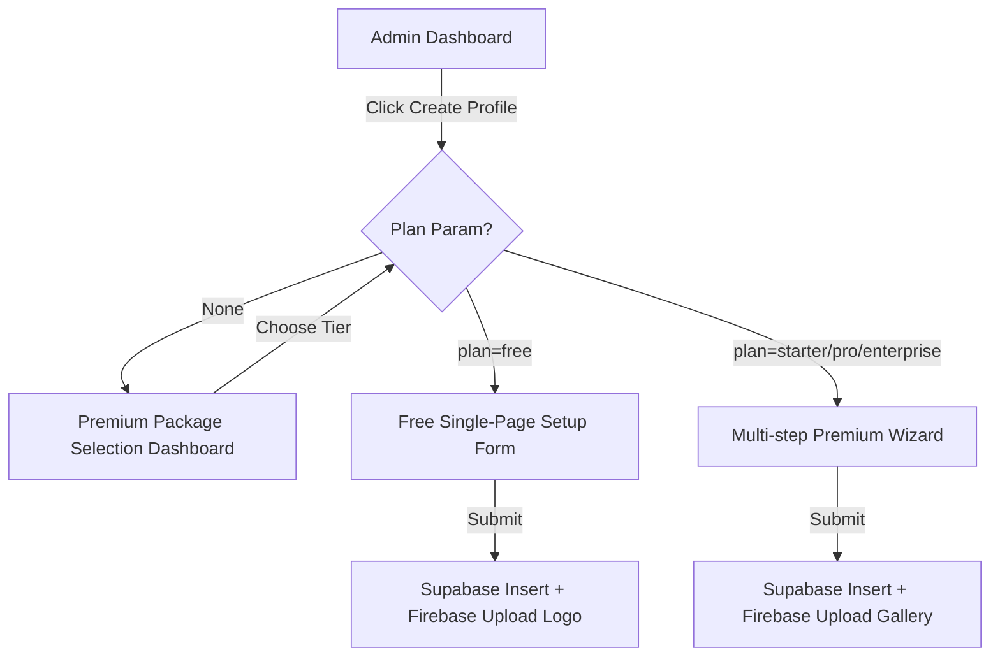
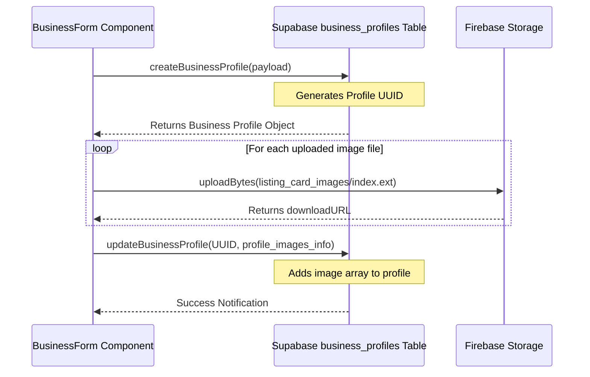

# 🏗️ Admin Business Profile Creation Architecture

The Business Profile Creation feature in `construction.lk` allows platform administrators to easily onboard and catalog construction companies and service providers under both **Free** and **Premium/Paid Tiers** (Starter, Pro, Enterprise).

## 🚀 Workflow Overview

---

## 🏛️ State Flow & Hydration

To keep components lightweight and decoupled, the creation wizard relies on active Redux slice states for static configurations:
1. **Industry/Categories**: Loaded from `categorySlice` using `useAppSelector(state => state.category.items)`. If not hydrated, dispatches `fetchCategoriesAsync()`.
2. **Districts & Cities**: Loaded from `locationSlice` using `useAppSelector(state => state.location.districts)`. If not hydrated, dispatches `fetchLocationsAsync()`.

---

## 🗃️ File Architecture

Following the standard UI rules, the creation process splits routes, orchestrating containers, and steps:

| Path | Responsibility |
| :--- | :--- |
| `src/app/(admin-portal)/admin/business/create/page.tsx` | Thin router page wrapper. Handles query param checking, renders the stunning Package Selector, or loads forms. |
| `src/components/business/FreeBusinessForm.tsx` | Accelerated creation form for the Free plan (single-page, rapid publication). |
| `src/components/business/BusinessForm.tsx` | Core wizard orchestrator for paid plans. Coordinates step toggling and compiles transaction uploads. |
| `src/components/business/BasicInfoStep.tsx` | Wizard Step 1: Industry category, tagline, description, search tags, BR, and CIDA grading details. |
| `src/components/business/LocationContactStep.tsx` | Wizard Step 2: District, city, street address, and contact lines. |
| `src/components/business/MediaStep.tsx` | Wizard Step 3: Local drag-and-drop file uploaders + real-time `BusinessCard` preview. |
| `src/components/business/CategorySelector.tsx` | Dynamic drill-down hierarchical category selection dialog. |
| `src/components/business/CitySelector.tsx` | Dynamic drill-down hierarchical district & city selection dialog. |

---

## 🔌 Data Transaction Layer

### 1. Database Creation
`BusinessService.createBusinessProfile(supabase, profilePayload)` inserts the base profile records.
- Status is set to `"active"` immediately since it is created by an Admin.
- Subscriptions are flagged as `"active"`.

### 2. Multi-Asset Upload Loop
Images are uploaded to **Firebase Storage** under:
`business_profiles/${businessId}/listing_card_images/${slot.index}.${fileExtension}`

### 3. Media Metadata Update
URLs returned from storage are gathered into `profile_images_info` and updated on the record via:
`BusinessService.updateBusinessProfile(supabase, businessId, { profile_images_info: { listing_card_images: urls } })`

---

## 📍 Related Vault Notes
- [[Project_Map]]
- [[Admin_BusinessList]]
- [[Category_System]]
- [[Location_Picker]]

*Created by Antigravity*
