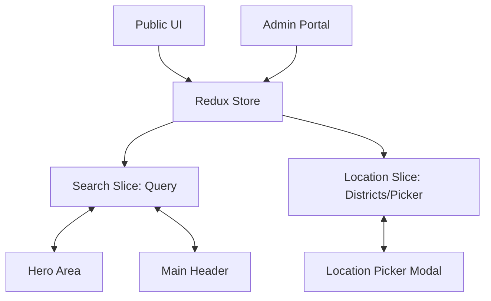

# 🗺️ Master Project Map

This is the entry point for the `construction.lk` technical vault. 

## 🏗️ System Architecture

## 📂 Quick Links
### 1. 📂 [[00_Dashboard|Dashboard]]
- High-level project status and active tasks.

### 2. 🏛️ [[Architecture_Overview|Architecture]]
- Deep dive into state management and modular design.
- **Key Files**:
    - [searchSlice.ts](file:///home/senidu/PROJECTS/SLB/construction.lk/src/redux/slices/searchSlice.ts)
    - [locationSlice.ts](file:///home/senidu/PROJECTS/SLB/construction.lk/src/redux/slices/locationSlice.ts)
    - [store.ts](file:///home/senidu/PROJECTS/SLB/construction.lk/src/redux/store.ts)

### 3. ✨ Feature Documentation
- [[Location_Picker]]: Regional selection logic.
- [[Global_Search]]: Synchronized search query system.

### 4. 🛠️ Technical Reference
- [[Hydration_Mismatch_Fix]]: How we handled persistent state in SSR.

---

## 📍 Source Code Entry Points
| Feature | Primary File |
| :--- | :--- |
| **Global Header** | [main-layout.tsx](file:///home/senidu/PROJECTS/SLB/construction.lk/src/components/layouts/main-layout.tsx) |
| **Hero Search** | [hero-area.tsx](file:///home/senidu/PROJECTS/SLB/construction.lk/src/components/home/sections/hero-area.tsx) |
| **Location Modal** | [location-picker-modal.tsx](file:///home/senidu/PROJECTS/SLB/construction.lk/src/components/location-picker-modal.tsx) |

---
*Created by Antigravity*
