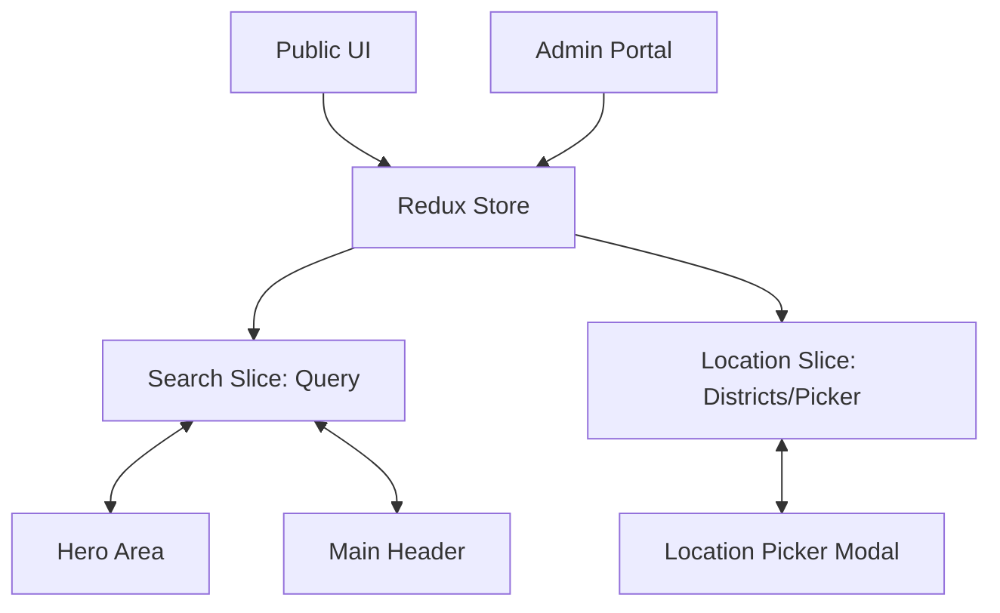

# 🗺️ Master Project Map

This is the entry point for the `construction.lk` technical vault. 

## 🏗️ System Architecture

## 🧱 Redux Layout (Current)
| Layer | Path | Purpose |
| :--- | :--- | :--- |
| Store | `src/redux/store.ts` | Register reducers and expose app types |
| Typed Hooks | `src/redux/hooks.ts` | Enforce safe `dispatch`/`selector` typing |
| Provider | `src/redux/provider.tsx` | Mount Redux store in app tree |
| Slices | `src/redux/slices/*.ts` | Domain state + reducers + async thunks |
| UI Consumers | `src/components/*`, `src/app/*` | Read/write state with typed hooks |

## 🧩 UI Structure Standard
For complex admin features, follow:
- Route wrapper in `src/app/**/page.tsx`
- Feature container in `src/components/<domain>/`
- Reusable sections in `src/components/<domain>/<feature-folder>/`
- Data access in `src/services/supabase/*Service.ts`

Reference implementation: [[Admin_BusinessList]]

## 🔌 Service Layer Structure
- Supabase domain services: `src/services/supabase/*Service.ts`
- Firebase integration services: `src/services/firebase/*`
- Shared typed schema: `src/types/supabase.ts`

Rules:
- Supabase table CRUD/RPC belongs in `services/supabase`.
- Firebase-specific workflows (auth/storage SDK concerns) belong in `services/firebase`.
- UI/Redux layers should call services, not issue raw backend queries when service methods exist.

## 📂 Quick Links
### 1. 📂 [[00_Dashboard|Dashboard]]
- High-level project status and active tasks.

### 2. 🏛️ [[Architecture_Overview|Architecture]]
- Deep dive into state management and modular design.
- [[Architecture_State_Management|The 4-Pillar State Philosophy & SSR Hydration]]
- [[Application_Bootstrap|Application Initialization Strategy]]
- **Key Files**:
    - [searchSlice.ts](file:///home/senidu/PROJECTS/SLB/construction.lk/src/redux/slices/searchSlice.ts)
    - [locationSlice.ts](file:///home/senidu/PROJECTS/SLB/construction.lk/src/redux/slices/locationSlice.ts)
    - [categorySlice.ts](file:///home/senidu/PROJECTS/SLB/construction.lk/src/redux/slices/categorySlice.ts)
    - [store.ts](file:///home/senidu/PROJECTS/SLB/construction.lk/src/redux/store.ts)

### 3. ✨ Feature Documentation
- [[Location_Picker]]: Regional selection logic (JIT Realtime Sync).
- [[Global_Search]]: Synchronized search query system.
- [[Category_System]]: Category dictionary, SSR Hydration, and AllCategoriesModal.
- [[Admin_BusinessList]]: Admin-side business listing page and operations.
- [[Admin_Location_Management]]: Admin-side district/city management dashboard.

### 4. 🛠️ Technical Reference
- [[Hydration_Mismatch_Fix]]: How we handled persistent state in SSR.
- [[Redux_Workflow]]: How to add fields, thunks, and new Redux-managed features safely.
- [[Cross_Project_Network]]: Shared links across all active project AI maps.

---

## 📍 Source Code Entry Points
| Feature | Primary File |
| :--- | :--- |
| **Global Header** | [main-layout.tsx](file:///home/senidu/PROJECTS/SLB/construction.lk/src/components/layouts/main-layout.tsx) |
| **Hero Search** | [hero-area.tsx](file:///home/senidu/PROJECTS/SLB/construction.lk/src/components/home/sections/hero-area.tsx) |
| **Location Modal** | [location-picker-modal.tsx](file:///home/senidu/PROJECTS/SLB/construction.lk/src/components/location-picker-modal.tsx) |
| **Admin Business List** | [BusinessList.tsx](file:///home/senidu/PROJECTS/SLB/construction.lk/src/components/admin/BusinessList.tsx) |
| **Admin Location Management** | [page.tsx](file:///home/senidu/PROJECTS/SLB/construction.lk/src/app/(admin-portal)/admin/manage-city/page.tsx) |

---
*Created by Antigravity*
