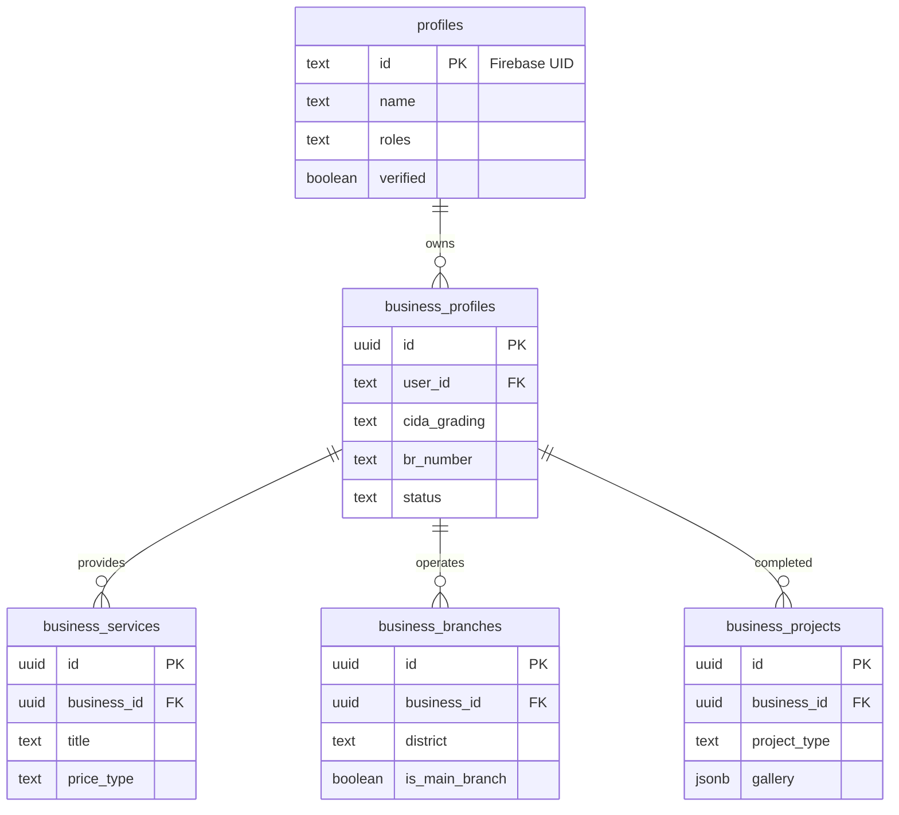

# Construction.lk Architecture Overview

This document outlines the database architecture and technical strategy for **construction.lk**, a specialized construction industry portal for Sri Lanka.

## 1. Technical Stack
- **Framework**: Next.js (Frontend & API)
- **Database**: Supabase (PostgreSQL)
- **Authentication**: Firebase Auth (Firebase UID as Primary Key in `profiles`)
- **Storage**: Firebase Storage (Images/Videos)
- **Search**: PostgreSQL Full-Text Search (planned)

---

## 2. Database Schema (Supabase)

### 2.1 Core User & Auth (`profiles`)
The foundation of the system, linking Firebase Auth to the local database.
- **Table**: `profiles`
- **Primary Key**: `text` (Firebase UID)
- **Roles**: RBAC system using custom functions (`is_admin`, `is_super_admin`).
- **Fields**: email, name, phone, address, verified, roles (array).

### 2.2 Business Entities (`business_profiles`)
The primary directory listing for companies.
- **Table**: `business_profiles`
- **Key Industry Fields**:
  - `br_number`: Business Registration number for verification.
  - `cida_grading`: Official CIDA (Construction Industry Development Authority) grade (C1 to C9).
  - `cida_specialties`: Specialized fields recognized by CIDA.
  - `service_districts`: Areas where the company can deploy labor/machinery.
  - `is_vat_registered`: VAT status for professional billing.

### 2.3 The Store Model (`business_services`)
Supports the "Services as Products" strategy seen in industry leaders like Wedabima.
- **Table**: `business_services`
- **Purpose**: Individual pages for specific services (e.g., "Waterproofing in Colombo").
- **Fields**: Title, Slug (SEO), Description, Price Type (Negotiable, Fixed, Range), Units (per sqft, per day).

### 2.4 Multi-Branch System (`business_branches`)
Handles companies with multiple physical locations.
- **Table**: `business_branches`
- **Constraint**: Only one "Main Branch" per business.
- **Fields**: Branch name, Address, District, City, Contact overrides (WhatsApp/Phone).

### 2.5 Portfolio System (`business_projects`)
The "Proof of Work" section for construction companies.
- **Table**: `business_projects`
- **Fields**: Title, Slug, Project Type (Residential, Commercial, etc.), Status (Completed, Ongoing), Gallery (JSONB), Client Name.

---

## 3. Relationship Diagram

---

## 4. Security Model (RLS)

The system uses **Supabase Row Level Security (RLS)** with **Firebase JWT** integration.
- **Public**: Can view `active` profiles, services, and projects.
- **Authenticated (Owner)**: Can Perform CRUD on their own business data.
- **Admin**: Full access to manage verification statuses and moderation.

---

## 5. Strategic Features
1. **Granular SEO**: Individual slugs for Services and Projects to capture specific long-tail search traffic (e.g., "Acro jack rental Sri Lanka").
2. **CIDA Verification**: Tiered levels based on official construction standards.
3. **Location Intelligence**: Distinct tables for Districts and Branches to support "Near Me" searches and map integration.
